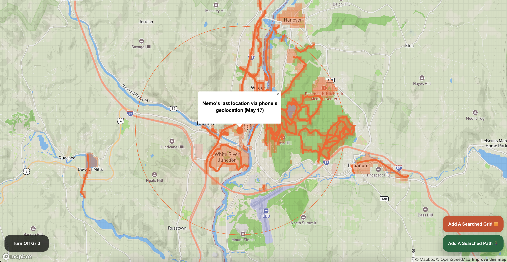
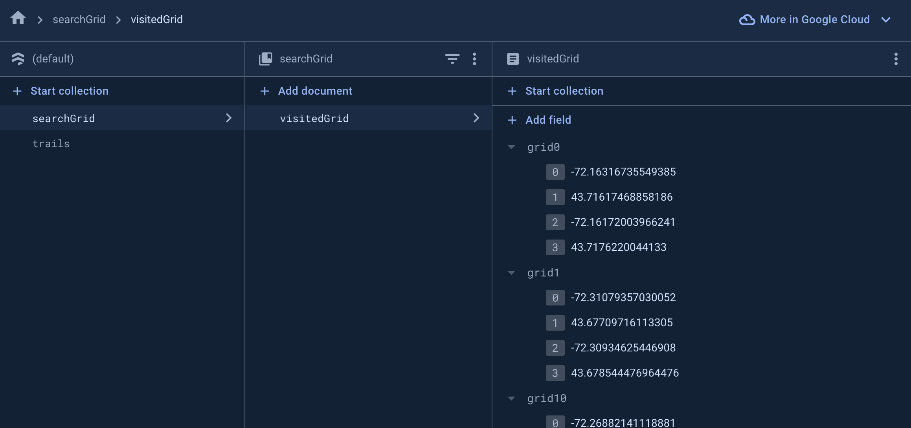
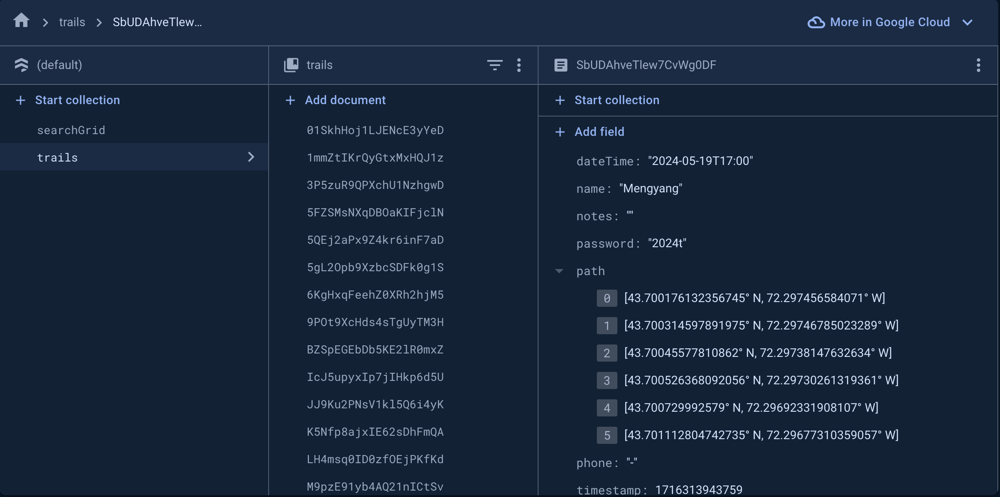

# Simple Missing Persons Search App
This web app is designed to assist in the search for missing persons by recording all the trails and search efforts on both Desktop and Mobile. The goal is to quickly set up an app using free services from Mapbox and Firebase for free-tier API access.



## Features
- **Trail Recording**: Keep track of all the trails and areas that have been searched.
- **Search Coordination**: Collaborate with others by sharing search efforts and updates in real-time.
- **Data Visualization**: Visualize search data on an interactive map.
- **Grid Search**: Mark grid areas that have been searched to coordinate efforts effectively.

## Installation
To get started with the app, follow these steps:

1. **Clone the repository**:
    ```sh
    git clone https://github.com/iamkaikai/simple-SAR-web-app.git
    ```

2. **Navigate to the project directory and install dependencies**:
    ```sh
    cd simple-SAR-web-app
    npm install
    ```

3. **Navigate to the client directory and install client dependencies**:
    ```sh
    cd client
    npm install
    ```

4. **Replace your Mapbox token in the source code**:
    - Open `App.js` and replace `mapboxgl.accessToken` with your own Mapbox access token.

## Firebase Setup
To enable the Firestore functionality, follow these steps:

1. **Create a Firestore on Firebase**:
   - Go to the [Firebase Console](https://console.firebase.google.com/).
   - Click "Add project" and follow the instructions to set up your Firestore DB.
    
2. **Enable Firestore**:
   - In the Firebase Console, navigate to Firestore Database and click "Create database".

3. **Add Firebase Config to Your Project**:
   - In the Firebase Console, go to Project settings and find your Firebase SDK configuration.
   - Create a `firebase.js` file in your project and add the configuration. For example:
    ```javascript
    import { initializeApp } from 'firebase/app';
    import { getFirestore } from 'firebase/firestore';

    const firebaseConfig = {
      apiKey: "YOUR_API_KEY",
      authDomain: "YOUR_AUTH_DOMAIN",
      projectId: "YOUR_PROJECT_ID",
      storageBucket: "YOUR_STORAGE_BUCKET",
      messagingSenderId: "YOUR_MESSAGING_SENDER_ID",
      appId: "YOUR_APP_ID"
    };

    const app = initializeApp(firebaseConfig);
    export const firestore = getFirestore(app);
    ```
    - Create `searchGrid` and name the document `visitedGrid`. The `visitedGrid` contains a list of arrays which consist of four numbers that represent the polygon to render the grid on Mapbox.
    

    - Create `trails` and create one testing document. The id can be randomized. In the document, create one testing data to let Firestore know the data structure:
      - dateTime: "2024-05-18T14:00" (string)
      - name: "David" (string)
      - notes: "Hemlock Loop trail" (string)
      - password: "2024t" (string)
      - path: [43.667171369899904° N, 72.28390854567118° W] (array of geopoints)
      - phone: "8001231234" (string)
      - timestamp: 1716315267247 (number)


## Deploy the app
Since we use Firestore as the backend, we directly use Firebase to host the service. Follow these steps:

1. **Install Firebase CLI**:
    ```sh
    npm install firebase
    npm install -g firebase-tools
    ```

2. **Login to Firebase**:
    ```sh
    firebase login
    ```

3. **Initialize Firebase in your project**:
    ```sh
    firebase init
    ```
    - "Which Firebase features do you want to set up for this directory?". Use the arrow down key and space to select "Hosting:Configure files for Firebase Hosting and (optionally) set up GitHub Action deploys"
    - Select the Firebase project you created for this app.
    - "What do you want to use as your public directory?", type in "build".
    - "Configure as a single-page app (rewrite all urls to /index.html)", type "Y" or "Yes"
    - Optional: You can set up Automatic Build whenever there is new push on Github. To do so, for "Set up automatic builds and deploys with GitHub?", type "Yes". There will be some extra steps required to set up the Github Repo. Else, type "No".
    - "File build/index.html already exists. Overwrite?", type "No".

4. **Build the project**:
    ```sh
    cd client 
    npm run build
    ```

5. **Deploy to Firebase**:
    ```sh
    firebase deploy
    ```

After these steps, your app should be live and accessible via the Firebase hosting URL provided after deployment.

## Contributing
Contributions are welcome! If you have suggestions for improvements or new features, please feel free to submit a pull request or open an issue.

## Future Work
Here are a few features that can be added in the future:
   - Allowing customization for coloring trails.
   - Announcement section for the latest news.
   - User authentication to avoid bots and malicious logging.

## Acknowledgements
I would like to thank everyone who supported me during the development of this project. Your encouragement and feedback were invaluable.

## License
This project is licensed under the MIT License.

## Contact
For any questions or suggestions, please reach out to me at [iamkaikai@livemail.tw](mailto:iamkaikai@livemail.tw).
